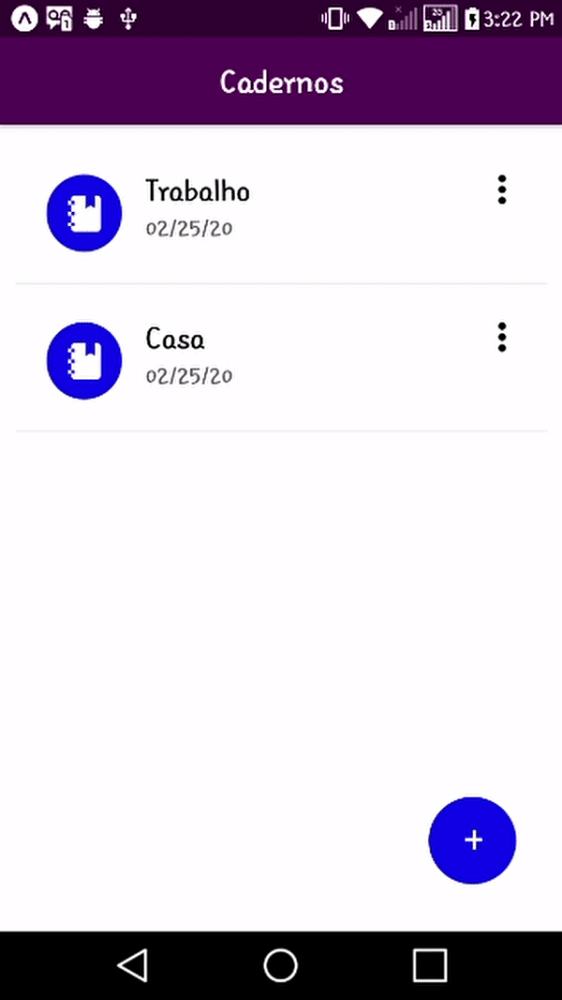

# Aplicativo para Gerenciamento de Tarefas

Aplicativo mobile completo para gerenciamento de tarefas (*todo app*) desenvolvido com React Native.

  

:rocket: **Tecnologias**:

- [React Native](https://facebook.github.io/react-native/)
- [Expo](https://expo.io/)

:package: **Bibliotecas**:

- [Redux](https://redux.js.org/)
- [React-Redux](react-redux.js.org)
- [React Native Action Button](https://www.npmjs.com/package/react-native-action-button)
- [Jest](https://jestjs.io/docs/en/using-matchers)

---

:coffee: Desenvolvido por Daniel Santos